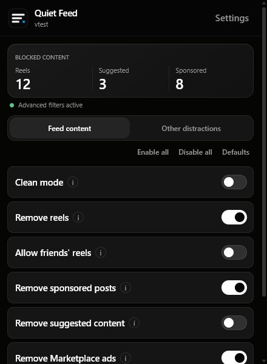
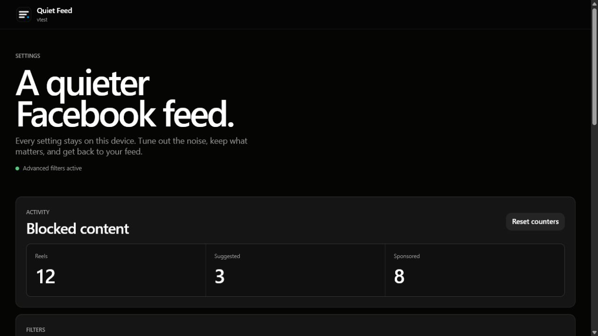
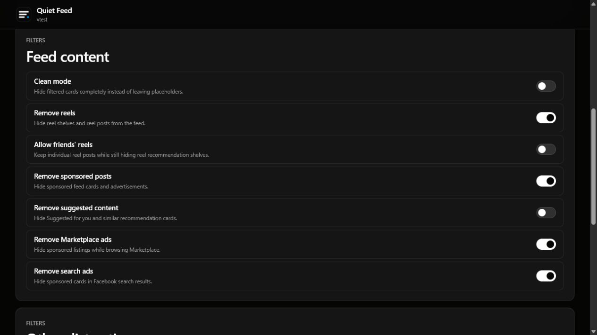

<div align="center">
  

# Quiet Feed

**A quieter, more intentional Facebook feed.**

Quiet Feed is a lightweight Manifest V3 browser extension that hides reels, sponsored posts, recommendations, and other distracting Facebook content. It has no account, no build step, and keeps settings and counters on your device.


</div>

## Overview

Facebook mixes posts from people you follow with reels, advertisements, recommendations, stories, and attention-grabbing overlays. Quiet Feed lets you choose which of those surfaces remain visible.

The project is deliberately small and readable:

- Plain HTML, CSS, and JavaScript
- No framework, bundler, or runtime dependency
- Local settings, local counters, and no Quiet Feed account
- A primary React-hook filtering path with a DOM-based fallback
- Accessible controls, keyboard-friendly tabs, and reversible filtering

> [!IMPORTANT]
> Facebook changes its internal interface frequently. Quiet Feed includes a fallback classifier, but occasional compatibility updates may still be necessary.

## Screenshots

<table>
  <tr>
    <td width="36%" valign="top">
      
    </td>
    <td width="64%" valign="top">
      
    </td>
  </tr>
  <tr>
    <td align="center"><strong>Extension popup</strong></td>
    <td align="center"><strong>Settings and activity</strong></td>
  </tr>
</table>

### Filter controls



## Features

### Feed controls

- Remove reel shelves and reel posts
- Optionally keep individual reels posted by friends
- Remove sponsored feed posts
- Remove suggested and recommended content
- Remove Marketplace advertisements
- Remove sponsored search results
- Use **Clean mode** to remove filtered cards without placeholders

### Other distractions

- Remove the stories tray
- Remove group suggestions
- Remove people suggestions
- Remove birthday reminders
- Remove popup notifications

### Custom filtering

- Add keyword or regex rules in the settings page to hide posts matching any pattern
- Rules apply in both the React hook engine and the DOM fallback
- Enter `/pattern/` syntax to use a regular expression

### Quality-of-life features

- Counters for blocked reels, suggestions, and sponsored posts — color-coded badge (green = advanced hooks, blue = DOM fallback)
- One-click **Enable all**, **Disable all**, and **Defaults** actions
- Per-item placeholders with a **Show this item** undo action when Clean mode is off
- Reveal list persisted in `chrome.storage.session` so undo state survives popup reopens
- Keyboard shortcut **Alt+Q** opens the popup; **Alt+Shift+Q** toggles Clean Mode without opening it
- **Pause 5 min** button temporarily disables all filtering with a single click
- Filter-health indicator showing whether advanced hooks or the DOM fallback are active
- In-page toast when the DOM fallback activates
- Filter log in the settings page — last 100 filtered items with timestamps and category badges
- Import and export for local settings and statistics
- Optional reload prompt after settings change
- Light, dark, and system theme toggle

## How it works

Quiet Feed uses two filtering layers:

1. **React hook engine** — intercepts known Facebook modules and removes matching units before they settle into the interface.
2. **DOM fallback** — activates when the advanced hook does not initialize, then classifies newly added Facebook content using readable text and context rules. Uses `IntersectionObserver` to defer processing of off-screen feed units, and a 30-second periodic prune to release disconnected DOM entries.

The fallback begins after a 4-second startup window so both engines do not compete. Once the hook engine signals readiness, the fallback stops entirely. Settings are shared through `chrome.storage.local`, and the background service worker serializes mutations to avoid overlapping writes.

```text
Facebook page
├── MAIN-world compatibility runtime (document_start)
├── MAIN-world page hooks (document_end)
│   └── React component interception + counter flush
└── Isolated content bridge (document_start)
    ├── Settings relay → page hook
    ├── DOM fallback classifier (MutationObserver + IntersectionObserver)
    ├── Custom keyword/regex rules
    ├── Reveal/undo list (chrome.storage.session)
    └── Blocked-content counters → background
```

### Schema migration

Settings are stored under a versioned schema key (`quietFeedSchemaVersion`). On install or update the background service worker reads the stored version, runs any applicable migration steps, and writes back a normalized copy. The current schema version is **2**.

## Privacy and permissions

Quiet Feed is designed to work without a remote service.

- **No account:** there is no Quiet Feed sign-in.
- **Local storage:** preferences and counters use `chrome.storage.local`; the undo list uses `chrome.storage.session`.
- **No analytics:** the project does not include tracking or telemetry code.
- **No external API:** filtering runs inside the extension and Facebook page.
- **Narrow host access:** page scripts run only on `www.facebook.com` and `web.facebook.com`.

The extension requests:

| Permission                   | Why it is needed                                                                    |
| ---------------------------- | ----------------------------------------------------------------------------------- |
| `storage`                    | Save settings, counters, schema version, filter log, and the selected popup tab.    |
| `https://www.facebook.com/*` | Run the filter on Facebook pages.                                                   |
| `https://web.facebook.com/*` | Run the same filter on Facebook's alternate web host.                               |

## Keyboard shortcuts

| Shortcut        | Action                          |
| --------------- | ------------------------------- |
| Alt+Q           | Open the Quiet Feed popup       |
| Alt+Shift+Q     | Toggle Clean Mode on/off        |

Shortcuts can be changed at `chrome://extensions/shortcuts`.

## Requirements

- Google Chrome 111 or newer
- A Facebook account and access to `facebook.com`
- Developer mode enabled when installing from source

Other Chromium-based browsers may work if they support the same Manifest V3 APIs, but Chrome is the documented target.

## Installation

Quiet Feed is currently installed from source as an unpacked extension.

1. Download or clone this repository.

   ```bash
   git clone https://github.com/huytqse170597/Quiet-Feed
   cd Quiet-Feed
   ```

2. Open `chrome://extensions` in Chrome.
3. Enable **Developer mode** in the top-right corner.
4. Select **Load unpacked**.
5. Choose the repository folder containing `manifest.json`.
6. Open or reload Facebook.

After pulling new source changes, return to `chrome://extensions` and select the extension's **Reload** button.

## Usage

1. Select the Quiet Feed icon in the browser toolbar.
2. Review the blocked-content counters and filter-health indicator.
3. Choose **Feed content** or **Other distractions**.
4. Toggle individual filters, or use the group actions above the list.
5. Select **Settings** for descriptions, custom rules, filter log, backup tools, resets, and the full activity view.

Changes are saved immediately. If Facebook is already open, Quiet Feed may offer to reload the affected tabs so every setting is applied consistently.

> [!CAUTION]
> **Remove suggested content** can hide a substantial part of the News Feed. Quiet Feed asks for confirmation before enabling it.

## Default configuration

| Setting                    | Default |
| -------------------------- | :-----: |
| Clean mode                 |   Off   |
| Remove reels               |   On    |
| Allow friends' reels       |   Off   |
| Remove sponsored posts     |   On    |
| Remove suggested content   |   Off   |
| Remove Marketplace ads     |   On    |
| Remove search ads          |   On    |
| Remove stories             |   Off   |
| Remove group suggestions   |   Off   |
| Remove people suggestions  |   Off   |
| Remove birthday reminders  |   Off   |
| Remove popup notifications |   Off   |

## Backup and restore

The settings page can export preferences and counters to a JSON file. That file can be imported later on the same browser or another Quiet Feed installation.

Imported data is validated and normalized before it is stored. Invalid or incompatible backup files are rejected without replacing the current configuration.

## Development

### Project structure

```text
Quiet-Feed/
├── icons/                         Extension icons
├── src/
│   ├── background.js              Storage, messages, badges, schema migration, tab reloads
│   ├── content.js                 Isolated bridge, DOM fallback, filter log
│   ├── filter-rules.js            Pure content-classification rules and custom rule matching
│   ├── page-hook.js               React component transformations
│   ├── legacy/
│   │   └── facebook-react-hook-runtime.js
│   ├── options/                   Full settings page (custom rules, filter log, backup)
│   ├── popup/                     Toolbar popup
│   └── shared/
│       ├── features.js            Feature schema, defaults, logger, merge utilities
│       ├── theme.css              Design tokens, component styles, forced-colors support
│       └── ui-components.js      createFeatureRow, createThemeToggle
├── tests/
│   ├── browser/                   Browser smoke-test harness and mocks
│   └── run-tests.js               Node-based test suite (37 tests)
├── .eslintrc.json                 ESLint config
├── manifest.json
└── package.json
```

### Install dependencies

There are no application dependencies to install and no production build command. Source files in `src/` are loaded directly by Chrome.

Node.js is required only to run the automated tests and local preview server.

### Lint

The project includes an ESLint config at `.eslintrc.json`. If ESLint is installed:

```bash
npx eslint src/
```

### Run the test suite

```bash
npm test
```

Or run the underlying script directly:

```bash
node tests/run-tests.js
```

The suite covers feature defaults, classification, custom rules, schema migration, message contracts, storage validation, manifest resources, hook/fallback coordination, accessible confirmations, keyboard shortcuts, filter log, IntersectionObserver integration, badge color, backup parsing, and forced-colors CSS.

### Run the browser smoke test

Start the local test server:

```bash
node tests/browser/popup-test-server.js
```

Then open:

```text
http://127.0.0.1:4173/src/popup/popup-test.html
```

The browser harness exercises category tabs, tooltips, confirmation dialogs, batch-action compatibility, pending-save locks, filter health, and reload prompts using the production popup code.

### Preview the UI

With the same local server running, use these mock-data preview pages:

- `http://127.0.0.1:4173/preview/popup.html`
- `http://127.0.0.1:4173/preview/options.html`

## Accessibility

- All feature toggles are keyboard-navigable (Tab, Enter, Space)
- Tab strip uses arrow-key navigation per the ARIA `tablist` pattern
- Filter health and save status use `aria-live` regions
- Filter log uses `role="log"` with `aria-live="polite"`
- Confirmation dialogs use native `<dialog>` with focus management
- `prefers-reduced-motion` disables all transitions and animations
- `forced-colors: active` (Windows High Contrast) is supported for toggle switches, health indicators, and primary buttons

## Contributing

Contributions are welcome. To propose a change:

1. Fork the repository and create a focused branch.
2. Keep production code readable and dependency-free unless a dependency has a clear, documented benefit.
3. Add or update tests for behavioral changes.
4. Run `npm test` before opening a pull request.
5. Describe the Facebook surface affected and include screenshots for interface changes.

When updating selectors or hook targets, include enough context for another contributor to understand what Facebook changed and why the new rule is safe.

## Support

Use the repository's **Issues** tab for bug reports, compatibility problems, and feature requests.

A useful bug report includes:

- Chrome version
- Quiet Feed version
- Facebook URL where the issue occurred
- Filter-health status shown by the popup (advanced / fallback / waiting)
- The affected setting
- A screenshot with personal information removed

Please do not post account credentials, cookies, private messages, or other sensitive Facebook data.

## Roadmap

Potential next steps include:

- Automated CI for the Node and browser suites
- Packaged release artifacts and clearer update instructions
- Compatibility checks for additional Chromium browsers
- Whitelist for specific profiles or pages
- Additional languages for interface labels and text classification
- Post-age and seasonal filtering

Roadmap items are proposals, not release commitments.

## Project status

Quiet Feed is under active development. Facebook compatibility is maintained as its page structure and private modules evolve.

## Authors and acknowledgments

Quiet Feed is maintained by its contributors. Thanks to everyone who reports interface changes, tests new Facebook layouts, and improves the readable filtering rules.

Facebook and Meta are trademarks of Meta Platforms, Inc. Quiet Feed is an independent project and is not affiliated with, endorsed by, or sponsored by Meta.

## License

This repository does not currently include a license file. Until a license is added, default copyright law applies; do not assume permission to copy, modify, or redistribute the project beyond what applicable law allows.
